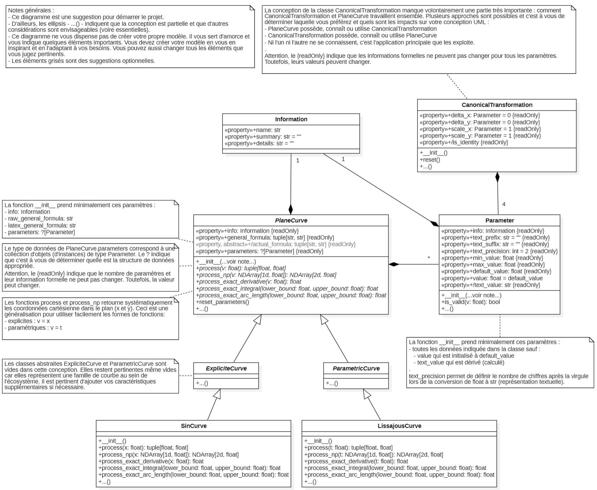

<small>**C**égep du **V**ieux **M**ontréal&nbsp;&nbsp;&nbsp;|&nbsp;&nbsp;&nbsp;**S**ciences, **I**nformatique et **M**athématique</small><br><br>

# 420-SF3 Projet 1

<a id="home"></a>
## Logiciel d'exploration de méthodes numériques

#### Table des matières
- [I. Introduction](#i-introduction)
- [II. Objectifs spécifiques du projet](#ii-objectifs-spécifiques-du-projet)
- [III. Spécifications fonctionnelles](#iii-spécifications-fonctionnelles)
- [IV. Contraintes](#iv-contraintes)
- [V. Rapport final et autoévaluation](#v-rapport-final-et-autoévaluation)
- [VI. Présentation des widgets mis à votre disposition](#vi-présentation-des-widgets-mis-à-votre-disposition)
- [VII. Grille d'évaluation](#vii-grille-dévaluation)
- [VIII. Références](#viii-références)

## I. Introduction
Ce projet consiste à développer une application informatique visant l'exploration de méthodes numériques. Le logiciel offrira à l'usager un outil interactif pour explorer ces méthodes et mieux comprendre leur fonctionnement.

Ce projet est le premier du cours 420-SF3-RM et vaut pour 20 % de la note finale du cours. Il constitue aussi la base de connaissances du premier examen. 

L'objectif principal de ce projet est de mettre en pratique les notions vues en classe depuis le début de votre DEC. Il ne suffit pas de produire un logiciel fonctionnel : il faut aussi démontrer une bonne maîtrise des concepts de programmation enseignés.

[↩️](#home)

## II. Objectifs spécifiques du projet

On divise les objectifs du projet en deux catégories : les objectifs fonctionnels et les objectifs de qualité. Dans les deux cas, on s'attend à ce que l'étudiant profite du projet pour mettre en pratique ces notions.

### A. Objectifs fonctionnels

Les objectifs fonctionnels du projet sont les suivants :
1. Le logiciel doit offrir une interface utilisateur intuitive et interactive autant que possible.
2. Le logiciel se divise en quatre parties principales : 
   - sélection et configuration de la courbe mathématique,
   - paramétrisation de la transformation canonique,
   - sélection et exploration de la technique numérique,
   - un graphique affichant toutes les informations pertinentes de l'exploration en cours.
3. Deux méthodes d'analyse numérique doivent être implémentées :
    - dérivation numérique
    - intégration numérique d'aire
4. Quoique l'interactivité du graphique soit un atout important, il est recommandé de débuter le projet en provoquant la mise à jour du graphique manuellement via un bouton. Progressivement, un élément à la fois, vous ajusterez le logiciel pour offrir les interactions en temps réel.

### B. Objectifs de qualité

La note finale n'est pas exclusivement liée au respect des fonctionnalités demandées. Au contraire, une partie importante est attribuée en considération de la qualité du code et de la rigueur scientifique, en tenant compte des aspects suivants :
- structure de code d'un bon niveau et **modulaire** (*DRY*),
- qualité de la programmation **orientée objet** (abstraction, encapsulation, héritage, polymorphisme),
- utilisation pertinente des **structures de données** (choix adapté et analyse de la complexité pour justifier vos choix),
- utilisation juste de la bibliothèque de calcul numérique `NumPy` (utilisation intelligente du `ndarray` et vectorisation lorsque possible),
- utilisation juste de la bibliothèque graphique Qt `PySide6` (modularité, héritage, widgets personnalisés par composition, signaux et slots, ...),
- utilisation juste de la bibliothèque de graphiques `PyQtGraph` (graphique encapsulé dans un widget, éléments mis à jour plutôt que recréés),
- **qualité** générale du code : lisibilité, autodocumentation, commentaires, documentation, citation de ses sources, ...


[↩️](#home)

## III. Spécifications fonctionnelles

Les spécifications fonctionnelles du projet sont les suivantes :

- On désire un logiciel de bureau (*desktop application*).
- Pour chaque technique d'analyse numérique, quatre sections sont requises :
    1. un panneau de sélection de la courbe mathématique à analyser et de ses paramètres,
    2. un panneau permettant de configurer la transformation canonique,
    3. un panneau exploratoire de la méthode numérique,
    4. un graphique interactif affichant la courbe mathématique et les résultats de la méthode.
- Il est possible de partager les panneaux de même nature (1, 2 et 4) entre les différentes techniques d'analyse numérique. Toutefois, sachez que cette approche est un peu plus difficile et demande légèrement plus de travail. 

### Courbes mathématiques à analyser

Vous devez implémenter quatre courbes mathématiques à analyser, dont deux explicites et deux paramétriques. Le document [`math_fonctions_suggerees.md`](./rappels/math_fonctions_suggerees.md) présente 6 courbes suggérées.

Les courbes présentées sont :
- Courbes explicites :
    - La sinusoïde
    - Le polynôme d'ordre $n$
    - La sinusoïde amortie
- Courbes paramétriques :
    - La courbe de Lissajous
    - La trochoïde
    - La fleur polaire

### Méthodes d'analyse numérique

Les méthodes d'analyse numérique à implémenter sont :
- [dérivation numérique](./rappels/math_derivation_numerique.md)
- [intégration numérique d'aire](./rappels/math_integration_numerique.md)

**Suggestion optionnelle.** Si le temps le permet, vous pouvez ajouter une troisième méthode : le calcul numérique de la longueur d'arc. On remplace la courbe par une ligne brisée de $N$ segments, puis on additionne leurs longueurs. Cet ajout n'est ni exigé ni évalué.

### Paramètre de configuration

Dans plusieurs contextes du projet, on doit définir la valeur d'un paramètre numérique (un nombre entier ou réel) servant à la configuration d'un aspect du projet. La récurrence de ce besoin impose de le gérer de manière claire et structurée.  

Un paramètre numérique doit inclure :
- un nom,
- une valeur minimale, maximale et par défaut,
- sa valeur actuelle modifiable par l'utilisateur,
- une description sommaire affichée en info-bulle,
- des instructions de formatage permettant la conversion du nombre en chaîne de caractères, incluant la précision du nombre, un préfixe ou un suffixe.

Dans le reste du document, on fera référence à ces composants par *paramètres numériques*.

### Panneau de sélection de la courbe mathématique

Le panneau de sélection de la courbe mathématique doit permettre à l'utilisateur de choisir la courbe à analyser ainsi que d'ajuster ses paramètres internes. Il doit inclure :

- Un menu déroulant pour sélectionner la courbe mathématique.
- Un champ de saisie pour chacun des *paramètres numériques* internes de la courbe.
- Un bouton permettant de réinitialiser les paramètres à leur valeur par défaut.
- Un bouton permettant d'afficher, dans une boîte de dialogue, une description détaillée de la courbe sélectionnée et de ses paramètres.

### Panneau de configuration de la transformation canonique

Le panneau de configuration de la transformation canonique doit permettre à l'utilisateur de sélectionner et de configurer la transformation canonique appliquée à la courbe mathématique. Il doit inclure :

- Quatre champs de saisie pour chacun des *paramètres numériques* de la transformation canonique.
- Des boutons réinitialisant chacun des 4 paramètres pour des transformations connues : identité, symétrie horizontale, symétrie verticale.

### Panneau de visualisation de la courbe mathématique

Ce panneau doit afficher graphiquement la courbe mathématique sélectionnée en tenant compte des paramètres internes et de la transformation canonique appliquée. Il doit inclure :
- Un titre principal.
- Une zone de tracé affichant la courbe.
- Des axes avec des titres, des graduations et des étiquettes.
- Une légende indiquant tous les constituants du graphique.
- Selon l'analyse numérique en cours, les informations supplémentaires indiquées dans les sections correspondantes doivent être affichées.

Comme mentionné, le graphique doit être dynamique et refléter en temps réel les modifications apportées aux divers paramètres de l'application (courbe, transformation et analyse numérique). Toutefois, on recommande un développement progressif étape par étape de cette partie.

### Panneau exploratoire de la dérivation numérique

On utilise la méthode des différences finies pour la dérivation numérique (voir le document [`math_derivation_numerique.md`](./rappels/math_derivation_numerique.md)). Le panneau exploratoire doit inclure ces éléments :
- les intrants :
    - $P$, le point d'intérêt où la pente est évaluée, défini par la variable indépendante de la courbe :
        - courbe explicite : l'abscisse $x$, avec $P = (x, f(x))$
        - courbe paramétrique : le paramètre $t$, avec $P = (x(t), y(t))$
    - $h$, le pas de comparaison, exprimé dans l'unité de la variable indépendante
    - $\alpha$, le facteur de positionnement des deux points voisins autour de $P$
    - trois boutons permettant de déterminer rapidement la valeur de $\alpha$ :
        - `Avant` : $\alpha = 0.0$ (différence avant)
        - `Centrée` : $\alpha = 0.5$ (différence centrée)
        - `Arrière` : $\alpha = 1.0$ (différence arrière)
    - $r$, l'étendue de la partie visible de la courbe autour de $P$. Le graphique affiche la courbe entre $x - r$ et $x + r$, ou entre $t - r$ et $t + r$ pour une courbe paramétrique. Ce paramètre ne sert pas au calcul de la dérivée, mais uniquement à l'affichage.
- les extrants :
    - résultats numériques :
        - $\widehat{m}$, la pente approchée de la courbe en $P$, issue de la dérivation numérique
        - si $m$ est disponible :
            - $m$, la pente exacte de la courbe en $P$, issue du calcul analytique
            - $E_a$, l'erreur absolue : $E_a = \widehat{m} - m$
            - $E_r$, l'erreur relative : $E_r = \displaystyle \frac{E_a}{m}$, si $m \neq 0$
    - s'ajoutent au graphique :
        - le point $P$
        - si $m$ est disponible, la tangente à la courbe en $P$
        - les deux points voisins $P_-$ et $P_+$ définissant l'intervalle d'évaluation autour de $P$
        - la droite passant par ces deux points voisins.
- les actions :
    - un bouton permet de réinitialiser les paramètres à leur valeur par défaut.
    - un bouton permet d'afficher une description de la méthode par une boîte de dialogue.
    - tout changement des intrants doit mettre à jour automatiquement le graphique et les extrants.

### Panneau exploratoire de l'intégration d'aire numérique

On utilise les méthodes des rectangles et des trapèzes pour l'intégration numérique d'aire (voir le document [`math_integration_numerique.md`](./rappels/math_integration_numerique.md)). Le panneau exploratoire doit inclure ces éléments :
- les intrants :
    - les bornes sur la variable indépendante de la courbe (attention, on veut garantir que la première est inférieure à la seconde) :
        - courbe explicite : $a$ et $b$, deux valeurs de $x$
        - courbe paramétrique : $t_a$ et $t_b$, deux valeurs de $t$
    - $N$, le nombre de sous-intervalles entre les bornes
    - deux méthodes d'intégration sélectionnables par l'utilisateur :
        - la méthode des rectangles
        - la méthode des trapèzes
    - seulement pour la méthode des rectangles :
        - $\alpha$, le facteur de positionnement du point d'évaluation dans chaque sous-intervalle
        - trois boutons permettant de déterminer rapidement la valeur de $\alpha$ :
            - `Gauche` : $\alpha = 0.0$
            - `Milieu` : $\alpha = 0.5$
            - `Droite` : $\alpha = 1.0$
- les extrants :
    - résultats numériques :
        - $\widehat{I}$, la valeur approchée de l'intégrale entre les bornes, issue de l'intégration numérique
        - si $I$ est disponible :
            - $I$, la valeur exacte de l'intégrale entre les bornes, issue du calcul analytique
            - $E_a$, l'erreur absolue : $E_a = \widehat{I} - I$
            - $E_r$, l'erreur relative : $E_r = \displaystyle \frac{E_a}{I}$, si $I \neq 0$
    - s'ajoutent au graphique :
        - une forme géométrique par sous-intervalle : un rectangle ou un trapèze, selon la méthode.
- les actions :
    - un bouton permet de réinitialiser les paramètres à leur valeur par défaut.
    - un bouton permet d'afficher une description de la méthode par une boîte de dialogue.
    - tout changement des intrants doit mettre à jour automatiquement le graphique et les extrants.

### Résumé des exigences

Les tableaux suivants résument les exigences détaillées dans les sections précédentes. En cas de divergence, le texte détaillé fait foi.

#### Exigences générales

| Exigence | Contrainte |
| :--- | :--- |
| Type de logiciel | Application de bureau (*desktop application*) |
| Courbes mathématiques | 4 courbes, dont 2 explicites et 2 paramétriques |
| Méthodes numériques | 2 méthodes imposées : <br> 1. Dérivation numérique <br> 2. Intégration numérique d'aire |
| Sections de l'interface | 1. Sélection de la courbe <br> 2. Transformation canonique <br> 3. Exploration de la méthode numérique <br> 4. Graphique |
| Langage de programmation | `Python` |
| Bibliothèques à utiliser | `NumPy` <br> `PySide6` <br> `PyQtGraph` (obligatoire pour le graphique) |
| Bibliothèques interdites | Toute autre bibliothèque, par exemple `SymPy`, `SciPy` et `Matplotlib` |
| Mise à jour de l'affichage | Automatique à tout changement d'un intrant (développement progressif recommandé) |

#### Paramètre numérique

Chaque *paramètre numérique* du logiciel réunit les composants suivants.

| Composant | Description |
| :--- | :--- |
| Nom | Identifie le paramètre dans l'interface |
| Valeur minimale | Borne inférieure permise |
| Valeur maximale | Borne supérieure permise |
| Valeur par défaut | Valeur initiale, rétablie lors d'une réinitialisation |
| Valeur actuelle | Valeur modifiable par l'utilisateur |
| Description | Texte sommaire affiché en info-bulle |
| Formatage | Conversion du nombre en texte : précision, préfixe et suffixe |

#### Panneaux communs

| Panneau | Élément | Description |
| :--- | :--- | :--- |
| Sélection de la courbe | Choix de la courbe | Menu déroulant |
| | Paramètres internes | Un champ de saisie par *paramètre numérique* de la courbe sélectionnée |
| | Actions | 1. Bouton réinitialisant les paramètres à leur valeur par défaut <br> 2. Bouton affichant, dans une boîte de dialogue, la description de la courbe et de ses paramètres |
| Transformation canonique | Paramètres | Un champ de saisie pour chacun des 4 *paramètres numériques* : <br> 1. Translation horizontale $\delta_x$ <br> 2. Translation verticale $\delta_y$ <br> 3. Échelle horizontale $s_x$ <br> 4. Échelle verticale $s_y$ |
| | Préréglages | Boutons fixant les 4 paramètres pour une transformation connue : <br> 1. Identité <br> 2. Symétrie horizontale <br> 3. Symétrie verticale |
| Visualisation | Contenu | 1. Titre principal <br> 2. Zone de tracé affichant la courbe <br> 3. Axes avec titres, graduations et étiquettes <br> 4. Légende de tous les constituants du graphique <br> 5. Ajouts propres à la méthode numérique en cours |
| | Comportement | Le tracé tient compte des paramètres internes de la courbe et de la transformation canonique |

#### Méthodes numériques

| | Dérivation | Intégration d'aire |
| :--- | :--- | :--- |
| Document de référence | [`math_derivation_numerique.md`](./rappels/math_derivation_numerique.md) | [`math_integration_numerique.md`](./rappels/math_integration_numerique.md) |
| Intrants | 1. Point d'intérêt $P$, défini par $x$ ou par $t$ <br> 2. Pas $h$ <br> 3. Facteur de positionnement $\alpha$ <br> 4. Étendue visible $r$ (affichage seulement) | 1. Bornes $a$ et $b$, ou $t_a$ et $t_b$ <br> 2. Nombre de sous-intervalles $N$ <br> 3. Méthode : rectangles ou trapèzes <br> 4. Facteur de positionnement $\alpha$ (rectangles seulement) |
| Raccourcis pour $\alpha$ | `Avant` : $\alpha = 0.0$ <br> `Centrée` : $\alpha = 0.5$ <br> `Arrière` : $\alpha = 1.0$ | `Gauche` : $\alpha = 0.0$ <br> `Milieu` : $\alpha = 0.5$ <br> `Droite` : $\alpha = 1.0$ <br> (rectangles seulement) |
| Valeur approchée | $\widehat{m}$, la pente de la courbe en $P$ | $\widehat{I}$, l'intégrale entre les bornes |
| Valeur exacte | $m$, si disponible | $I$, si disponible |
| Ajouts au graphique | 1. Le point $P$ <br> 2. La tangente à la courbe en $P$, si $m$ est disponible <br> 3. Les deux points voisins $P_-$ et $P_+$ autour de $P$ <br> 4. La droite passant par ces deux points | Une forme géométrique par sous-intervalle : rectangle ou trapèze |

#### Éléments communs à toutes les méthodes

Dans ce tableau, $\widehat{v}$ désigne la valeur approchée et $v$ la valeur exacte, comme dans le [lexique](./rappels/math_lexique.md).

| Élément | Description |
| :--- | :--- |
| Résultats affichés | 1. Valeur approchée $\widehat{v}$ <br> 2. Valeur exacte $v$, si disponible <br> 3. Erreur absolue $E_a = \widehat{v} - v$, si $v$ est disponible <br> 4. Erreur relative $E_r = \dfrac{E_a}{v}$, si $v$ est disponible et non nulle |
| Actions | 1. Bouton réinitialisant les paramètres à leur valeur par défaut <br> 2. Bouton affichant, dans une boîte de dialogue, la description de la méthode |
| Mise à jour | Tout changement d'un intrant met à jour le graphique et les résultats |

### Éléments de conception logicielle

Avant d'entamer le développement, vous devez produire un document de conception UML détaillant les classes et les interactions entre elles. Rappelez-vous que seules les classes associées au modèle sont requises. Les classes de l'interface utilisateur ne sont pas à réaliser.

On s'attend à ce que le document de conception UML inclue toutes les classes du modèle ainsi que leurs relations, telles que l'héritage, la composition, l'agrégation et la dépendance. Les diagrammes doivent suivre les conventions établies dans la norme de codage du cours. 

On met à votre disposition une conception préliminaire de la gestion des courbes mathématiques. Ce diagramme est incomplet et n'est pas imposé strictement. Vous pouvez l'adapter à votre guise. D'ailleurs, il est impossible de réaliser le projet tel quel sans y apporter des modifications. Vous pouvez l'ignorer et repartir de zéro si vous le souhaitez. Toutefois, sachez que vous devez valoriser les notions de la programmation orientée objet. 

Le diagramme suivant introduit les classes du modèle :
- `Information`
- `Parameter`
- `PlaneCurve`
- `ExplicitCurve`
- `ParametricCurve`
- `SinCurve`
- `LissajousCurve`
- `CanonicalTransformation`

<p align="center">
  
</p>

Aucun diagramme de classes UML n'est fourni pour les modèles associés aux méthodes numériques. Toutefois, on peut s'attendre à ce que des classes spécifiques soient définies pour encapsuler la logique de ces méthodes. C'est à vous de valoriser au maximum vos compétences à cet effet.

Dans tous les cas, on peut s'attendre à voir minimalement les classes suivantes :
- `NumericalDifferentiation`
- `NumericalIntegrationArea`

Dans toutes les classes du modèle, l'utilisation de `NumPy` est attendue.

Finalement, on vous suggère de faire plusieurs diagrammes de classes UML pour faciliter la production et la lecture de votre conception.

#### Considérations pour les classes de l'interface graphique utilisateur

Même si vous n'avez pas à produire de conception UML pour cette partie, vous devez tout de même produire un code réutilisable et bien organisé.

On peut imaginer avoir minimalement une classe par panneau :
- `QPlaneCurvePanel`
- `QCanonicalTransformationPanel`
- `QGraphicPanel`
- `QNumericalDifferentiationPanel`
- `QNumericalIntegrationAreaPanel`

Toutes ces classes héritent de `QWidget` et exploitent habilement le modèle.

Elles possèdent toutes :
- des accesseurs et des mutateurs leur permettant de manipuler les paramètres,
- des signaux et slots permettant de réagir aux changements de paramètres.


[↩️](#home)

## IV. Contraintes 

On divise les contraintes en deux catégories : les contraintes techniques et les contraintes de gestion de projet.

### A. Contraintes techniques

- Les technologies à utiliser sont :
    - `Python`
    - `PySide6`
    - `PyQtGraph`
    - `NumPy`
    - `Visual Studio Code`
    - Dans tous les cas, on utilisera les versions correspondantes aux environnements de l'école.
- Les documents de conception suivants sont attendus :
    - vous devez faire une maquette relativement détaillée de votre interface utilisateur
    - vous devez produire un diagramme de classes UML présentant toutes les classes nécessaires au modèle, principalement : 
        - les courbes mathématiques
        - les méthodes d'analyse numérique
        - **important** :
            - il est attendu que vous produisiez ces documents avant de commencer le développement
            - ces documents ne doivent pas être parfaits et peuvent évoluer au cours du développement
            - ces documents doivent être produits en équipe et validés par tous les membres avant de commencer
            - il ne faut pas faire les classes de l'interface utilisateur
- Le code doit suivre la [`norme_de_codage`](./informations/norme_de_codage.md) du cours.
- Pour `NumPy` :
    - vous devez utiliser `ndarray` pour les calculs numériques
    - vous devez éviter les boucles `for` lorsque possible en utilisant la vectorisation
- L'interface utilisateur avec `PySide6` :
    - l'interface utilisateur doit être conçue en code (pas de `*.ui` généré par Qt Designer)
    - l'interface utilisateur doit être modulaire et réutilisable (création de widgets personnalisés composés de widgets)
    - l'interface utilisateur doit utiliser les signaux et slots pour la communication entre les composants
    - l'interface utilisateur doit être *responsive* (utilisation pertinente des *layouts* en ne fixant pas de tailles absolues sauf pour quelques cas particuliers).
- Le graphique avec `PyQtGraph` :
    - le graphique doit être produit avec `PyQtGraph`
    - le graphique doit être encapsulé dans un widget personnalisé basé sur `PlotWidget`, qui s'intègre aux *layouts* comme tout autre widget
    - les données tracées doivent être transmises directement sous forme de `ndarray`, sans conversion en liste
    - chaque constituant du graphique (courbe, point d'intérêt, points voisins, tangente, rectangles, ...) doit être un élément distinct, identifié dans la légende
    - les éléments du graphique doivent être créés une seule fois, puis mis à jour à chaque changement (par exemple avec `setData`), plutôt que détruits et recréés
    - pour les courbes paramétriques, il est recommandé de verrouiller le rapport d'aspect (`setAspectLocked`) pour ne pas déformer la courbe
    - le zoom et le déplacement à la souris offerts par `PyQtGraph` doivent rester fonctionnels
    - à terme, le graphique doit suivre en temps réel toutes les modifications des intrants ; il est toutefois recommandé de débuter le projet en provoquant la mise à jour du graphique via un bouton.
- Le logiciel ne doit pas *planter* dans des conditions normales d'utilisation. Vous devez gérer les erreurs et les exceptions de manière appropriée. On mettra l'accent sur ces aspects :
    - validation des intrants utilisateur
    - gestion des erreurs de calcul (division par zéro, racine carrée de nombre négatif, logarithme de nombre négatif, ...)
    - messages d'erreur clairs et informatifs pour l'utilisateur
- Produit final
    - L'enseignant vous présentera l'exemple d'un logiciel fonctionnel pour le projet. 
    - Toutefois, gardez en tête que ce n'est qu'un exemple. 
    - Autrement dit, vous avez pleine liberté pour produire la forme du logiciel qui vous inspire, pourvu que vous répondiez aux exigences fonctionnelles et techniques du projet.

### B. Contraintes de gestion de projet

- Projet d'équipe :
    - Le projet doit être réalisé en équipe de quatre étudiants. Si le nombre d'étudiants inscrits dans la classe ne permet pas de former des équipes de quatre, des ajustements seront faits par l'enseignant.
    - Chaque étudiant doit contribuer de manière significative au projet. 
    - Un fichier d'autoévaluation est à remplir par l'équipe à la fin du projet (cette évaluation sera prise en compte dans la note finale en pondérant l'implication de chacun).
    - La programmation en binôme (*pair programming*) doit être au premier plan (voir le document [`programmation_binome`](./informations/programmation_binome.md)).
    - Chaque équipe possède deux sous-équipes de deux personnes.
    - La permutation des membres des sous-équipes doit être fréquente (maximum 1 heure entre chaque permutation).
- Étapes de développement recommandées :
    - **Planification** : 
        - Assurez-vous de bien comprendre le projet, ses objectifs et les fonctionnalités attendues. Le projet est costaud et beaucoup de documents sont mis à votre disposition.
        - Il est important de bien lire ce document et d'en clarifier le contenu avec vos collègues de travail d'abord et avec l'enseignant ensuite.
        - Rédigez un plan de projet avec des jalons et des échéances.
        - Divisez les tâches entre les membres de l'équipe en fonction de leurs compétences et intérêts.
    - **Conception** : 
        - Produisez une maquette détaillée de l'interface utilisateur.
        - Faites la conception UML (diagramme de classes) des classes du modèle : les courbes mathématiques et les méthodes d'analyse numérique.
        - Il est important que tous les membres de l'équipe comprennent et approuvent la conception avant de commencer le développement.
    - **Développement** : 
        - Formez des sous-équipes de deux personnes et répartissez les tâches selon les divisions faites lors de la planification.
        - Codez les fonctionnalités en vous assurant de tester régulièrement votre code.
        - La programmation en binôme (*pair programming*) doit être au premier plan.
- Structure de dossiers et remise du projet :
    - La remise du projet doit inclure tous les fichiers et dossiers nécessaires au bon fonctionnement du code, les documents produits et tous les documents initialement fournis.
    - Le projet doit être remis avant la date limite indiquée.
    - Toute forme de plagiat ou de tricherie entraînera des sanctions sévères conformément aux politiques académiques de l'institution. Si vous avez des questions sur ce qui est permis ou non, n'hésitez pas à les poser.
    - La remise du projet se fait via Moodle à raison d'une remise par équipe.
    - Vous devez maintenir votre projet fonctionnel dans la structure de travail stricte qui vous est imposée. Référez-vous au document [`structure_projet`](./informations/structure_projet.md).
    - Le fichier `readme.md` est un document standard de présentation d'un projet. Il permet de fournir des informations essentielles sur ce dernier, son installation, son utilisation, ses contributeurs, sa documentation et sa licence. Pour ce projet, on vous demande d'inclure au minimum :
        - une présentation sommaire du projet,
        - les technologies utilisées,
        - le nom des auteurs.

### C. Fichiers à modifier et à produire

L'arborescence suivante liste tous les fichiers attendus à la remise. Un fichier **à modifier** vous est fourni et vous le complétez. Un fichier **à créer** n'existe pas encore.

```
projects/p1/
│
├── main.py                              À MODIFIER : point d'entrée de votre application
├── readme.md                            À MODIFIER : présentation, technologies et auteurs
│
├── model/
│   └── *.py                             À CRÉER : code, classes du modèle, sans Qt
│
├── gui/
│   └── q_*.py                           À CRÉER : code, classes de l'interface graphique
│
└── doc/out/
    ├── assets/
    │   └── *.png                        À CRÉER : images insérées dans les documents de des/,
    │                                               soit les maquettes et les diagrammes UML,
    │                                               en version initiale et en version finale
    ├── des/
    │   ├── maquettes.md                 À MODIFIER : assemblage des maquettes
    │   └── uml_modele.md                À MODIFIER : assemblage des diagrammes UML
    └── final/
        ├── rapport_final.md             À MODIFIER : rapport final
        ├── autoevaluation_equipe.xlsx   À MODIFIER : autoévaluation de l'équipe
        └── commentaires_et_coquilles.md OPTIONNEL : commentaires sur le projet
```

Sont aussi optionnels : les tests (`tests/test_*.py`), les ressources de l'application (`assets/`) et vos fichiers de travail (`doc/out/work/`).

Aucun autre fichier fourni ne doit être modifié, notamment les fichiers `__init__.py`, `__main__.py` et `_info.md`, ainsi que tout le contenu de `doc/in/` et de `edustem/`. Le document [`structure_projet`](./informations/structure_projet.md) présente la structure complète.

[↩️](#home)

## V. Rapport final et autoévaluation

À la fin du projet, vous avez un rapport final à produire. 

Le rapport consiste à répondre à des questions spécifiques reliées au projet. Le document existe déjà ([`/out/final/rapport_final.md`](../out/final/rapport_final.md)) et est prêt à accueillir vos réponses.

Vous y retrouverez tous les détails nécessaires pour compléter ce rapport. Voici tout de même les grandes lignes :
- Identification des membres de l'équipe
- Respect des exigences
- Discussions techniques
    - Conception et modélisation
    - Structures de données
    - Paradigme de programmation orientée objet
    - Interprétation du mandat
- Évaluation individuelle

N'oubliez pas que vous devez **obligatoirement** remplir en équipe le document [`/out/final/autoevaluation_equipe.xlsx`](../out/final/autoevaluation_equipe.xlsx). 

[↩️](#home)

## VI. Présentation des widgets mis à votre disposition 

Les widgets suivants sont mis à votre disposition pour faciliter le développement du projet :
- Classes utilitaires :
    - `QAbstractObject` et `QAbstractWidget` : deux classes de base permettant de définir des classes abstraites héritant respectivement de `QObject` et `QWidget`.
        > Il est impossible de déclarer une classe abstraite héritant de `ABC` et de `QObject` à la fois. Ces classes permettent de contourner cette limitation.
- Widgets :
    - `QColorBox` : widget affichant simplement une couleur.
    - `QLatexLabel` : widget affichant du texte en LaTeX.
    - `QRealSlider`, `QRealScrollBar`, `QRealDial` : widgets offrant des contrôles pour des valeurs réelles (disponibles dans `q_real_slider.py`).
    - `QSliderSpinBox` et `QRealSliderSpinBox` : widgets offrant un assemblage de `QSlider` + `QSpinBox` et `QRealSlider` + `QDoubleSpinBox` pour les valeurs entières et réelles respectivement (disponibles dans `q_slider_spin_box.py`).
    - D'autres widgets sont disponibles dans le dossier `edustem/pyside6`, à raison d'un widget par fichier `q_*.py`. Chacun possède une démonstration dans le sous-dossier `demo`.

### Note technique

Si vous désirez vider tous les éléments d'un `QLayout` (ou une classe dérivée), vous pouvez utiliser la fonction utilitaire `clearLayout` suivante :
```python
def clearLayout(layout: QLayout) -> None:
    """ Remove all widgets from the given layout.

    All widgets contained in the layout are removed and their parent is set to None,
    effectively detaching them from the layout and the widget hierarchy. If no other
    references to these widgets exist, they will be garbage collected. 

    Args:
        layout (QLayout): The layout to clear.
    
    Raises:
        TypeError: If the layout type is unsupported.
    """
    if isinstance(layout, QFormLayout):
        while layout.count() > 0:
            layout.removeRow(0)
    elif isinstance(layout, (QVBoxLayout, QHBoxLayout, QStackedLayout)):
        while layout.count() > 0:
            item = layout.itemAt(0)
            item.widget().setParent(None)
            layout.removeItem(item)
    else:
        raise TypeError(f'Unsupported layout type yet: {type(layout)}')
```

[↩️](#home)

## VII. Grille d'évaluation 

La grille d'évaluation suivante illustre les critères qui seront utilisés pour évaluer votre projet ainsi que la pondération de chaque élément.

| Catégorie | Critère | Pondération |
| :--- | :--- | ---: |
| <br> **Documents de conception** |  | <br> **10 %** |
| - Diagramme de classes UML *7 %* | - Niveau de détail <br> - Exploitation des concepts orientés objet <br> - Qualité de la présentation | 2 % <br> 4 % <br> 1 % |
| - Maquette de l'interface utilisateur *3 %* | - Niveau de détail <br> - Qualité de la présentation | 2 % <br> 1 % |
| <br> **Respect et qualité des spécifications** |  | <br> **65 %** |
| - Interface utilisateur *3 %* | - Intuitive <br> - Interactive <br> - Robustesse de l'application dans l'ensemble des scénarios d'usage | 1 % <br> 1 % <br> 1 % |
| - Courbes mathématiques *15 %* | - Modèle : <br> &nbsp; - Classes abstraites (ex : `PlaneCurve`, `ExplicitCurve`, `ParametricCurve`) et dépendances <br> &nbsp; - 4 classes concrètes : 2 courbes explicites et 2 courbes paramétriques <br> &nbsp; - Gestion des *paramètres numériques* <br> &nbsp; - Utilisation adéquate de `NumPy` (*vectorisation*) <br> - IUG : <br> &nbsp; - Sélection de la courbe <br> &nbsp; - Configuration de tous les paramètres de la courbe <br> &nbsp; - Bouton de réinitialisation <br> &nbsp; - Bouton d'information sur la courbe <br> &nbsp; - Réalisation technique par un *widget* autonome | <br> 3 % <br> 3 % <br> 1 % <br> 1 % <br><br> 1 % <br> 2 % <br> 1 % <br> 1 % <br> 2 % |
| - Transformation canonique *6 %* | - Modèle : <br> &nbsp; - Classe de transformation applicable aux courbes explicites et paramétriques <br> - IUG : <br> &nbsp; - Configuration des 4 paramètres <br> &nbsp; - Boutons de préréglage (identité et symétries) <br> &nbsp; - Réalisation technique par un *widget* autonome | <br> 2 % <br><br> 1 % <br> 1 % <br> 2 % |
| - Graphique *10 %* | - Titre, axes (titres, graduations et étiquettes) et légende <br> - Tracé de la courbe selon ses paramètres et la transformation canonique <br> - Mise à jour en temps réel <br> - Réalisation technique avec `PyQtGraph` par un *widget* autonome | 2 % <br> 3 % <br> 3 % <br> 2 % |
| - Dérivation numérique *15 %* | - Modèle : <br> &nbsp; - Classe de gestion de la méthode numérique <br> &nbsp; - Utilisation adéquate de `NumPy` (*vectorisation*) <br> - IUG : <br> &nbsp; - Paramétrisation de la méthode (4 paramètres et raccourcis pour $\alpha$) <br> &nbsp; - Affichage des résultats <br> &nbsp; - Ajouts au graphique (4 éléments) <br> &nbsp; - Boutons de réinitialisation et d'information <br> &nbsp; - Réalisation technique par un *widget* autonome | <br> 4 % <br> 1 % <br><br> 3 % <br> 2 % <br> 3 % <br> 1 % <br> 1 % |
| - Intégration numérique d'aire *16 %* | - Modèle : <br> &nbsp; - Classe de gestion de la méthode numérique (rectangles et trapèzes) <br> &nbsp; - Utilisation adéquate de `NumPy` (*vectorisation*) <br> - IUG : <br> &nbsp; - Paramétrisation de la méthode (bornes, sous-intervalles, méthode, $\alpha$ et ses raccourcis) <br> &nbsp; - Affichage des résultats <br> &nbsp; - Ajouts au graphique (rectangles ou trapèzes) <br> &nbsp; - Boutons de réinitialisation et d'information <br> &nbsp; - Réalisation technique par un *widget* autonome | <br> 5 % <br> 1 % <br><br> 3 % <br> 2 % <br> 3 % <br> 1 % <br> 1 % |
| <br> **Respect des objectifs** |  | <br> **15 %** |
| - Qualité générale *9 %* | - Structure de code adaptée et modulaire <br> - Qualité de la programmation orientée objet <br> - Utilisation pertinente des structures de données <br> - Utilisation juste de la bibliothèque `NumPy` <br> - Utilisation juste de la bibliothèque `PySide6` <br> - Qualité générale du code <br> - Remise adéquate et respect de la structure de travail imposée | 2 % <br> 2 % <br> 1 % <br> 1 % <br> 1 % <br> 1 % <br> 1 % |
| - Contraintes techniques *6 %* | - Respect de la norme de codage du cours <br> - Qualité de la `docstring` <br> - Interface conçue en code, avec des *layouts* adaptatifs <br> - Communication entre les composants par signaux et slots | 3 % <br> 1 % <br> 1 % <br> 1 % |
| <br> **Rapport** |  | <br> **10 %** |
| | | *100 %* |


[↩️](#home)


## VIII. Références

Consultez les documents suivants :
- comme guide de production technique :
    - [Le maquettage d'une interface graphique](./guides/maquettage_interface_graphique.md)
    - [Le diagramme de classes UML](./guides/diagramme_classes_uml.md)
- pour un rappel des notions mathématiques nécessaires à ce projet :
    - [Lexique des rappels mathématiques](./rappels/math_lexique.md)
    - [Représentations d'une courbe plane](./rappels/math_representations_courbe_plane.md)
    - [Transformation canonique d'une courbe](./rappels/math_transformation_canonique_courbe.md)
    - [Pente et aire d'une courbe transformée](./rappels/math_evaluations_courbe_transformee.md)
    - [Catalogue de courbes analytiques](./rappels/math_fonctions_suggerees.md)
    - [Techniques de dérivée numérique](./rappels/math_derivation_numerique.md)
    - [Méthodes d'intégration numérique](./rappels/math_integration_numerique.md)
- à titre de rappel des informations générales sur le projet :
    - [Structure de travail imposée](./informations/structure_projet.md)
    - [Norme de codage](./informations/norme_de_codage.md)
    - [La programmation en binôme](./informations/programmation_binome.md)
    - [Mises en garde concernant l'utilisation de l'intelligence artificielle](./informations/mises_en_garde_ia.md)

Plus largement, vous pouvez aussi consulter ces ressources en ligne pour vous aider dans le développement :
- Mathématiques : articles Wikipédia :
    - [Dérivée](https://fr.wikipedia.org/wiki/D%C3%A9riv%C3%A9e)
    - [Différences finies](https://fr.wikipedia.org/wiki/Diff%C3%A9rences_finies)
    - [Intégrale définie](https://fr.wikipedia.org/wiki/Int%C3%A9grale_d%C3%A9finie)
    - [Calcul numérique d'une intégrale](https://fr.wikipedia.org/wiki/Calcul_num%C3%A9rique_d%27une_int%C3%A9grale)

- Informatique : documentation officielle :
    - [Python](https://docs.python.org/3/)
    - [PySide6](https://doc.qt.io/qtforpython/)
    - [PyQtGraph](https://pyqtgraph.readthedocs.io/en/latest/)
    - [NumPy](https://numpy.org/doc/)

[↩️](#home)
