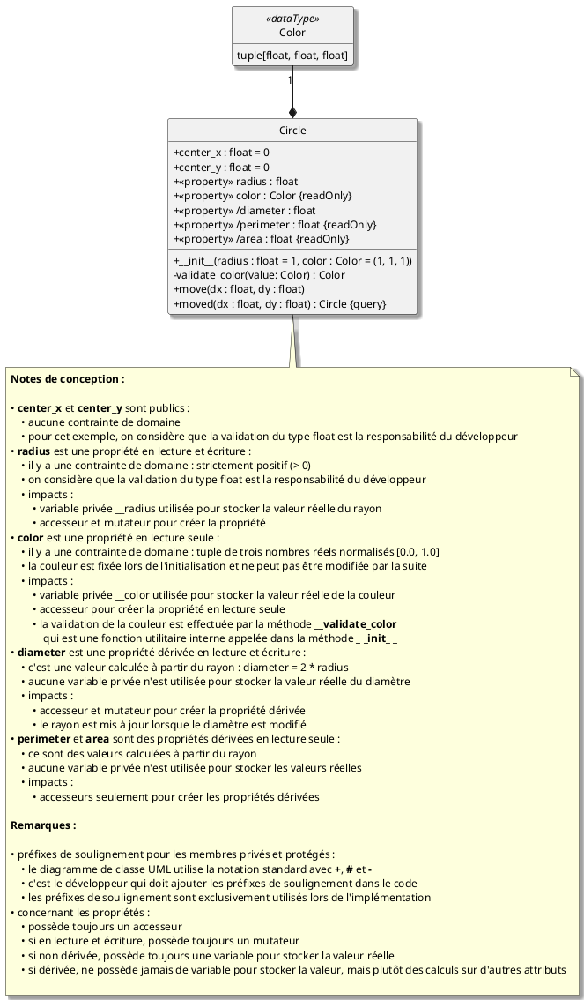

<small>**C**égep du **V**ieux **M**ontréal&nbsp;&nbsp;&nbsp;|&nbsp;&nbsp;&nbsp;**S**ciences, **I**nformatique et **M**athématique</small><br><br>

# <big>Norme de codage</big>
Guide de rédaction du code
<br><br>

## Table des matières

- [Introduction](#introduction)
- [En bref](#en-bref)
- [Norme de codage](#norme-de-codage-1)
    - [Généralités](#1-généralités)
    - [Emphases sur certaines pratiques](#2-emphases-sur-certaines-pratiques)
        - [Visibilité des membres à trois niveaux](#21-visibilité-des-membres-à-trois-niveaux)
        - [Propriétés](#22-propriétés)
        - [Marqueurs d'intention](#23-marqueurs-dintention)
        - [Idiomes et pratiques diverses](#24-idiomes-et-pratiques-diverses)
    - [Spécificités liées à certaines bibliothèques tierces](#3-spécificités-liées-à-certaines-bibliothèques-tierces)
        - [Matplotlib](#31-bibliothèque-matplotlib)
        - [NumPy](#32-bibliothèque-numpy)
        - [Qt - PySide6](#33-bibliothèque-qt---pyside6)
- [Annexes](#annexes)
    - [Annexe 1 - Qu'est-ce qu'une norme de codage?](#annexe-1---quest-ce-quune-norme-de-codage)
    - [Annexe 2 - Résumé de PEP 8](#annexe-2---résumé-de-pep-8)
    - [Annexe 3 - Complément sur la visibilité des membres de classe et des propriétés](#annexe-3---complément-sur-la-visibilité-des-membres-de-classe-et-des-propriétés)
    - [Annexe 4 - Compléments sur les marqueurs d'intention](#annexe-4---compléments-sur-les-marqueurs-dintention)
    - [Annexe 5 - Consultation des documents Markdown avec Visual Studio Code](#annexe-5---consultation-des-documents-markdown-avec-visual-studio-code)
 
<br><br>


## Introduction 
<small>[&#x2B06;&#xFE0F;](#table-des-matières) retour à la table des matières</small>

Ce document présente la norme de codage adoptée pour tous les cours d'informatique du programme SIM au CVM. L'objectif est d'assurer cohérence et qualité dans la rédaction du code tout au long du programme. Les étudiants sont donc encouragés à suivre ces recommandations dès le début de leur formation afin d'acquérir de bonnes habitudes de codage dès le départ.

> &#x2139;&#xFE0F; Les autres cours du programme SIM peuvent avoir des exigences différentes et ne sont pas nécessairement soumis à cette norme de codage (par exemple, les cours de mathématiques et de sciences).

Ce document est un guide de référence pour l'ensemble des quatre cours du programme SIM. Par conséquent, certains aspects présentés ici ne sont couverts que dans les cours plus avancés du programme. On retrouve les indicateurs `[SF1]`, `[SF2]`, `[SF3]` et `[SF4]` pour identifier les cours à partir desquels les notions associées sont introduites.

Pour mieux comprendre ce qu'est une norme de codage, se référer à l'[annexe 1](#annexe-1---quest-ce-quune-norme-de-codage).

## En bref
<small>[&#x2B06;&#xFE0F;](#table-des-matières) retour à la table des matières</small>

Le code doit respecter les conventions de style suivantes :

1. guide de style [PEP 8](https://www.python.org/dev/peps/pep-0008/)
2. emphases sur certaines pratiques :
   - visibilité des membres à trois niveaux
   - utilisation des propriétés
   - obligation d'utiliser les marqueurs d'intention
3. connaître les spécificités pour des bibliothèques tierces :
   - [Matplotlib](#31-bibliothèque-matplotlib)
   - [NumPy](#32-bibliothèque-numpy)
   - [Qt - PySide6](#33-bibliothèque-qt---pyside6)

## Norme de codage

### 1. Généralités
<small>[&#x2B06;&#xFE0F;](#table-des-matières) retour à la table des matières</small> 

> &#x1F5DD;&#xFE0F; **Appliquer la norme de codage `PEP 8`**

Le programme SIM adopte l'application de la norme de codage `PEP 8`.

Références :
- L'[annexe 2](#annexe-2---résumé-de-pep-8) présente un résumé de `PEP 8` et des éléments particulièrement importants.
- [`PEP 8`](https://www.python.org/dev/peps/pep-0008/) est la norme de codage officielle pour Python. On recommande de lire ce document petit à petit au fil de votre formation afin de renforcer votre maîtrise de la norme.

### 2. Emphases sur certaines pratiques
<small>[&#x2B06;&#xFE0F;](#table-des-matières) retour à la table des matières</small> 

La norme de codage valorise certaines pratiques spécifiques qui vont au-delà des recommandations générales de `PEP 8`. Ces pratiques restent recommandées dans plusieurs documents `PEP` et sont solidement ancrées dans la communauté Python. Elles ne sont pas des préférences locales ou des pratiques purement arbitraires justifiées par des raisons académiques.

#### 2.1. Visibilité des membres à trois niveaux

> &#x1F5DD;&#xFE0F; **Utiliser trois niveaux de visibilité : public, protégé et privé**

`PEP 8` met l'accent sur les visibilités *public* et *non public*. Pour des raisons académiques évidentes mais aussi comme pratique reconnue, on impose une granularité supplémentaire à 3 niveaux : public, protégé et privé.

Le tableau suivant donne un bref rappel sur le sens de chaque niveau de visibilité et de la convention de nommage associée.

| Niveau | Notation UML | Modificateur syntaxique | Nom | Portée |
| :--- | :---: | :--- | :--- | :--- |
| **public** | `+` | aucun | `self.value` | accessible partout |
| **protégé** | `#` | préfixé avec un simple soulignement | `self._value` | accessible par la classe et ses sous-classes |
| **privé** | `-` | préfixé avec un double soulignement | `self.__value` | accessible par la classe seulement |

Référence : l'[annexe 3](#annexe-3---complément-sur-la-visibilité-des-membres-de-classe-et-des-propriétés) donne plus de détails sur ce concept et les pratiques associées.

#### 2.2. Propriétés

> &#x1F5DD;&#xFE0F; **Utiliser les propriétés pour contrôler l'accès aux attributs**

Les propriétés permettent de définir des méthodes d'accès (accesseurs ou *getters*) et de modification (mutateurs ou *setters*) pour les attributs d'une classe tout en conservant une syntaxe d'accès similaire à celle des attributs publics. 

Cette approche permet le meilleur de deux mondes : on épouse la philosophie si chère à Python (Zen of Python, [PEP 20](https://www.python.org/dev/peps/pep-0020/)) où on a l'illusion d'accéder à des membres publics tout en ayant la capacité de contrôler l'accès et la modification des attributs de manière fine et sécurisée à travers des fonctions.

Cette pratique est en lien direct avec la gestion de la visibilité des membres présentées au point précédent.

L'[annexe 3](#annexe-3---complément-sur-la-visibilité-des-membres-de-classe-et-des-propriétés) donne plus de détails sur ce concept, les pratiques associées ainsi que la notation `UML` adoptée.

#### 2.3. Marqueurs d'intention

> &#x1F5DD;&#xFE0F; **Utiliser les marqueurs d'intention pour rendre explicite le rôle et les contraintes du code**

Un marqueur d'intention est un élément **explicite** du code qui communique une intention, un rôle ou le contrat d'un élément du programme. Il formalise cette intention, plutôt que de le laisser deviner ou de le confier au seul commentaire.

Certains marqueurs sont réellement appliqués par l'interpréteur et deviennent obligatoires au sens strict et les ignorer change le comportement du programme. D'autres n'ont aucun effet à l'exécution mais sont vérifiés par les outils d'analyse statique. Les derniers ne reposent que sur la discipline du développeur et les conventions de la communauté. Cette hiérarchie de garantie détermine à quel moment, et par qui, une violation sera détectée.

La norme retient quatre familles de marqueurs :
- conventions de nommage : casse des identifiants, soulignement pour la visibilité
    - ces éléments sont déjà couverts dans les points antérieurs;
- annotations de type : pour les variables (membres, paramètres et locales) ainsi que les types de retour en utilisant la notation moderne de Python;
- classes structurantes : utilisées par héritage comme avec `ABC`, `Enum`, ...;
- décorateurs spécifiques : `@property`, `@staticmethod`, `@classmethod`, `@dataclass`, `@overload`, `@override`, `@final`, etc.

Dans un contexte académique, l'obligation d'utiliser ces marqueurs favorise un apprentissage plus rigoureux : elle évite de s'appuyer sur des pratiques implicites que la flexibilité de Python permettrait autrement.

Référence : l'[annexe 4](#annexe-4---compléments-sur-les-marqueurs-dintention) donne plus de détails sur ce concept, la hiérarchie des garanties et l'ensemble des mécanismes associés.

#### 2.4. Idiomes et pratiques diverses

On présente ici quelques pratiques reconnues obligatoires :
- Idiomes :
    - `main` : Pour exécuter le code principal d'un script, utiliser l'idiome :
      ```python
      def main():
          pass # Code principal du script

      if __name__ == "__main__":
          main()
      ```
    - concision de l'assignation et du retour booléen en utilisant directement l'expression booléenne :
      ```python
      # Mauvaise pratique
      value = False if result == False else True # analyse explicite

      # Bonne pratique
      value = bool(result) # analyse implicite

      # Mauvaise pratique
      if value1 >= 0 and value2 == True:
          return True
      else:
          return False

      # Bonne pratique
      return value1 >= 0 and value2
      ```
- Utilisation de la `docstring` Google :
    - tel que recommandé par la norme `PEP 8`, l'application de [PEP 257](https://www.python.org/dev/peps/pep-0257/) est valide;
    - toutefois, on recommande fortement la norme de Google (voir la section 3.8 de la [documentation de style de Google pour Python](https://google.github.io/styleguide/pyguide.html#38-comments-and-docstrings)).

### 3. Spécificités liées à certaines bibliothèques tierces
<small>[&#x2B06;&#xFE0F;](#table-des-matières) retour à la table des matières</small> 

#### 3.1. Bibliothèque `Matplotlib`

- `Matplotlib` utilise la convention `PEP 8` et sa pratique est obligatoire dans le cadre du programme.
- Sauf pour les cas justifiables, tous les graphiques possèdent :
    - un titre général
    - des titres et des unités pour les axes
    - une légende si plusieurs séries

#### 3.2. Bibliothèque `NumPy`

- `NumPy` utilise la convention `PEP 8` et sa pratique est obligatoire dans le cadre du programme.
- On utilise l'alias `np` pour l'importation de `numpy`  et il est obligatoire de toujours utiliser cet alias pour accéder aux fonctionnalités de `numpy`. 
- Il est également obligatoire d'utiliser les annotations de type `numpy` pour une meilleure lisibilité et maintenabilité du code. 
- Pour des raisons de performance et de lisibilité du code, l'utilisation de la vectorisation disponible par `NumPy`, est d'usage variable selon le contexte : 
    - obligatoire pour les cas évidents;
    - fortement recommandé pour les cas intermédiaires;
    - optionnel pour les cas plus complexes;
    - dans tous les cas, l'utilisation de l'intelligence artificielle n'est pas autorisée comme simple outil de production de code, vous devez pouvoir être en mesure d'expliquer vos solutions même après plusieurs semaines suivant les remises de travaux.
- Commenter les sections de code vectorisées plus complexes pour expliquer leur utilité et leur fonctionnement.

Voici un exemple :
```python
import numpy as np
import numpy.typing as npt

# Pour un type spécifique
data_1: npt.NDArray[np.int64] = np.array([1, 2, 3], dtype = np.int64)

# Pour une famille de type
data_2: npt.NDArray[np.integer] = np.array([1, 2, 3])

# Vectorisation triviale
data_1 **= 2 # Met au carré chaque élément de la matrice
data_1 = np.sqrt(data_1) # Calcule la racine carrée de chaque élément de la matrice

# Vectorisation simple
rng: np.random.Generator = np.random.default_rng(seed = 42)
radius: float = 0.0
data_2: npt.NDArray[np.float64] = rng.random((2, 1000))
selected_data: npt.NDArray[np.float64] = data_2[:, (data_2[0, :] ** 2 + data_2[1, :] ** 2) < radius ** 2]
```

#### 3.3. Bibliothèque `Qt - PySide6`

La bibliothèque `Qt` est réalisée en langage `C++` et possède des conventions différentes de celles présentées dans `PEP 8`.

Le portage (*binding*) de `C++` vers `Python` réalisé par la bibliothèque `PySide6` conserve ces conventions en offrant toutefois une adaptation particulière à ce problème d'intégration (voir la sous-section 3.3.6).

Malgré tout, nous utiliserons une double convention : 
- la norme `Qt` pour les classes héritant de `Qt`
- la norme `PEP 8` pour le reste du code.

##### 3.3.1. Précision sur la portée de l'exception

- Toute classe dont un ancêtre appartient à `PySide6` applique la norme `Qt` **dans tout son corps** (types, méthodes, attributs, signaux, variables locales, ...).
- La règle est transitive : si `QCustomPanel` hérite de `QWidget` et `QAdvancedCustomPanel` de `QCustomPanel`, les deux suivent la norme Qt.
- Tout appel à une API `Qt` s'écrit en syntaxe `Qt`, y compris depuis un module `PEP 8` (cet aspect est obligatoire de toute façon).
- Toutefois, tous les marqueurs d'intention s'appliquent intégralement (visibilité, annotations et autres).

    > &#x2139;&#xFE0F; Note importante : `ABC` ne se combine pas directement avec une classe `Qt` héritant de `QObject`. 
    > 
    > Si le besoin se présente, utiliser l'une des classes données à cet effet `QAbstractObject` ou `QAbstractWidget`. Ces classes ne font pas partie de `Qt` mais sont plutôt fournies par l'enseignant comme les autres classes utilitaires données.

- Le code Python standard respecte en tout point la norme présentée ailleurs dans ce document. En fait, on se fait un point d'honneur à respecter rigoureusement ces deux conventions afin de mieux discerner quelle partie du code utilise `Qt` et quelle partie utilise `PEP 8`.
- Il existe des situations ambigües où il peut être difficile de déterminer quelle norme appliquer. Par exemple, une fonction standard *non-Qt* utilisant des fonctionnalités de `Qt`. Évidemment, les appels à `Qt` doivent obligatoirement respecter l'API `Qt` mais, tous les autres éléments, doivent respecter la norme `PEP 8`.

##### 3.3.2. Sommaire de la convention de nommage
    
| Élément | Convention `PEP 8` | Exemple `PEP 8` | Convention `Qt` | Exemple `Qt` |
|:---|:---:|:---|:---:|:---|
| Fichier / module | `snake_case` | `my_class.py` | `snake_case` | `q_my_class.py` |
| Classe | `CapWords` | `MyClass` | `CapWords` <br> préfixé par la lettre `Q` | `QMyClass` |
| Constante | `UPPER_SNAKE_CASE` | `DURATION_MS: Final[float]` | `CapWords` | `DurationMs: Final[float]` |
| Membre d'énumération | `UPPER_SNAKE_CASE` | `Color.DARK_RED` | `CapWords` | `Color.DarkRed` |
| Méthode | `snake_case` | `compute_value()` | `camelCase` | `computeValue()` |
| Variable locale | `snake_case` | `current_value` | `camelCase` | `currentValue` |
| Membre public | `snake_case` | `self.current_value` | `camelCase` | `self.currentValue` |
| Membre protégé | `snake_case` | `self._render_buffer` | `camelCase` | `self._renderBuffer` |
| Membre privé | `snake_case` | `self.__render_buffer` | `camelCase` | `self.__renderBuffer` |
| Accesseur <br> *getter* | crée une propriété avec le décorateur `@property` | `@property`<br>`def prop(self) ...` | utilise une fonction explicite sans le mot `get` | `value()` |
| Mutateur <br> *setter* | utilise le décorateur `@<nom_de_l_attribut>.setter` | `@prop.setter`<br>`def prop(self, ...` | utilise une fonction explicite | `setValue()` <br> `reset()` |
| *Slot* | — | — | `camelCase` à l'**impératif** <br> décoré par `@Slot(...)` | `@Slot(int)`<br>`def changeValue(...` |
| *Signal* | — | — | `camelCase` au **passé** | `valueChanged: Signal` |

Notes complémentaires :

- Le mot `raise_` dans Qt est une exception puisqu'il remplace `raise`, un mot réservé de Python.
- Lors des importations, chaque classe doit être explicitement importée.

##### 3.3.3. Accesseurs et mutateurs

Dans une classe héritant de Qt, une donnée exposée se lit et s'écrit par méthodes :

| Rôle | Forme Qt | Exemple |
|---|---|---|
| Accesseur (lecture) | `x()` une fonction au nom de l'attribut sans le préfixe `get` | `value()`, `text()` |
| Accesseur booléen | `isX()`, `hasX()` | `isEnabled()`, `hasFocus()` |
| **Mutateur** (écriture) | `setX()` une fonction pouvant avoir plusieurs formes selon le contexte | `setValue()`, `setText()` <br> `reset()`, `resize(10, 100)` |

- Le décorateur `@property` est interdit dans une classe héritant de Qt.
- Un mutateur n'émet un signal que si la valeur change effectivement.

##### 3.3.4. Signaux et connecteurs

- `slot` :
    - Les fonctions membres de type connecteur sont toujours décorées de façon appropriée `@Slot(...)`. Ce décorateur n'est pas obligatoire en Python mais reste important pour la norme car il correspond à un marqueur d'intention.
- `signal` : 
    - Un signal est toujours public.
    - Le nom d'un signal correspond toujours à un verbe au passé.

##### 3.3.5. `@Property` de `PySide6`

`Qt` possède son propre mécanisme de propriétés et `PySide6` l'expose par le décorateur `@Property`, distinct de `@property`.

Son usage est autorisé mais réservé à un besoin avancé et justifié. Il ne remplace jamais l'accesseur et le mutateur, qui demeurent l'interface principale.

##### 3.3.6. Utilisation de l'extension  `snake_case` et `true_property`

`PySide6` offre la possibilité d'utiliser les extensions `snake_case` et `true_property` via la directive `from __feature__ import ...`. Cette approche puissante change la manière dont les noms des méthodes et des propriétés sont interprétés par Python, permettant de suivre plus fidèlement les conventions de nommage Python tout en restant compatible avec Qt. Cette fonctionnalité simplifie l'uniformisation du code mais présente plusieurs exceptions mal documentées et, principalement pour cette raison mais pas uniquement, cette pratique est interdite.

```python
from __feature__ import snake_case, true_property   # INTERDIT
```

##### 3.3.7. Membres ajoutés dynamiquement

Un membre ajouté après coup à un objet Qt suit la norme Qt.

```python
button: QPushButton = QPushButton()
button.customValue: Any = None
```

##### 3.3.8. Exemple

```python
from typing import override
from PySide6.QtCore import Signal, Slot, QSize
from PySide6.QtWidgets import QWidget


class QGauge(QWidget):

    valueChanged = Signal(int)                         # signal toujours public

    def __init__(self, parent: QWidget | None = None) -> None:
        super().__init__(parent)
        self._maximum: int = 100                       # protected
        self.__value: int = 0                          # private

    def value(self) -> int:                            # accesseur
        return self.__value

    @Slot(int)                                         # déclaration explicite d'un connecteur
    def setValue(self, value: int) -> None:            # mutateur
        if value == self.__value:                      # pas d'émission inutile
            return
        clamped = max(0, min(value, self._maximum))    # contrôle de la valeur entrante
        self.__value = clamped                         # assignation
        self.valueChanged.emit(clamped)                # émission du signal correspondant
        self.update()                                  # mise à jour de l'affichage

    @override                                          # substitution polymorphique explicite
    def sizeHint(self) -> QSize:
        return QSize(200, 24)
```

## Annexes

### Annexe 1 - Qu'est-ce qu'une norme de codage?
<small>[&#x2B06;&#xFE0F;](#table-des-matières) retour à la table des matières</small> 

Une norme de codage présente :
- des conventions;
- des lignes directrices;
- un ensemble de plusieurs règles déterminant la pratique de rédaction du code;
- ce qui est considéré comme une bonne pratique.

Elle permet d'assurer une certaine qualité logicielle et une uniformisation de la pratique à travers :
- les divers intervenants d'un projet;
- le temps;
- les technologies employées.

Cette pratique du génie aide un logiciel à être davantage :
- maintenable : peut évoluer plus facilement;
- portable : il fonctionne similairement dans différents environnements;
- testable : il peut être testé par des procédures standardisées à l'interne;
- fiable : il fonctionne tel qu'attendu;
- sécuritaire : facilite la production de logiciels plus robustes.

En offrant un code :
- uniforme;
- plus facile à lire;
- plus facile à écrire;
- respectant des guides établis par des développeurs expérimentés;
- apportant les compromis nécessaires à une pratique de qualité.

Dans l'industrie, une norme de codage peut être stricte, contraignante et détaillée ou
complètement l'inverse. De plus, aucune norme n'est la meilleure. Les normes varient selon les entreprises,
les projets, les développeurs, les langages de programmation, les cultures, l'époque, etc. 

L'important n'est pas spécifiquement la norme elle-même mais plutôt l'attitude consistant à adopter et à faire les efforts pour suivre une norme de codage validée par des développeurs expérimentés.

### Annexe 2 - Résumé de `PEP 8`
<small>[&#x2B06;&#xFE0F;](#table-des-matières) retour à la table des matières</small> 

Contrairement à plusieurs autres langages, Python possède une norme de codage officielle appelée [PEP 8 – Style Guide for Python Code](https://www.python.org/dev/peps/pep-0008/).

Même si cette convention reste techniquement optionnelle et qu'il est tout à fait possible d'adopter d'autres pratiques, il faut garder en tête que l'industrie et les projets publics suivent largement `PEP 8` pour du code Python. Autrement dit, bien que celle-ci ne soit pas strictement obligatoire, elle constitue la référence principale pour le style de code dans le programme SIM au CVM.

`PEP 8` correspond à une certaine mise en pratique formelle de la philosophie *"The Zen of Python"*, qui met l'accent sur la lisibilité, la simplicité et la cohérence du code. Le Zen de Python est présenté officiellement dans la [PEP 20 – The Zen of Python](https://www.python.org/dev/peps/pep-0020/).

`PEP 8` couvre plusieurs aspects du code, notamment :
- l'indentation et l'espacement;
- le nommage des modules, classes, fonctions et variables;
- les conventions pour les commentaires et les docstrings;
- la structure générale du code;
- et bien d'autres sujets.

Les éléments suivants présentent un résumé de quelques éléments clés de `PEP 8`.

- **Convention de nommage** : 
    - Modules : utiliser des noms courts en `snake_case`.
    - Classes : utiliser la convention `CapWords`.
    - Fonctions et variables : utiliser la convention `snake_case`.
    - Constantes : utiliser la convention `UPPER_SNAKE_CASE`.
    - Utiliser des noms explicites facilitant la compréhension du code et servant d'autodocumentation.
- **Indentation et espacements** : 
    - indentation :
        - utiliser 4 espaces par niveau d'indentation, éviter les tabulations. 
    - horizontal : 
        - Autour des opérateurs et des virgules, ajouter un espace pour améliorer la lisibilité.
    - vertical : 
        - Entre les classes et les fonctions du premier niveau, utiliser 2 lignes vides.
        - Entre les fonctions de la même classe, utiliser 1 ligne vide.
- **Structure générale du code** : 
    - Utiliser des lignes vides pour séparer les sections de code et améliorer la lisibilité.
    - Organiser le code en sections logiques et regrouper les fonctions et classes connexes.
    - Éviter les fonctions et classes trop longues, privilégier la modularité et la réutilisabilité du code.
- **Commentaires et docstrings** : 
    - Utiliser des commentaires pour expliquer le code qui mérite une explication. Ne jamais commenter l'évidence ou traduire en français ou en anglais le code lui-même. Les commentaires doivent plutôt fournir un contexte, expliquer les choix de conception ou clarifier des parties complexes du code.
    - Utiliser des *docstrings* pour documenter les modules, les classes et les fonctions. On utilise la norme [PEP 257](https://www.python.org/dev/peps/pep-0257/) pour les conventions de *docstrings* ou la norme de Google (voir la section 3.8 de la [documentation de style de Google pour Python](https://google.github.io/styleguide/pyguide.html#38-comments-and-docstrings)).
- **Importation de modules** :
    - Placer l'importation de modules au tout début du fichier (juste après la *docstring* du module si elle existe).
    - Suivre l'ordre suivant :
        1. Les modules du noyau Python comme `math`, `random` et `sys` par exemple.
        2. Les modules tiers comme `matplotlib`, `numpy` et `pyside6` par exemple.
        3. Les modules locaux (ceux que vous développez vous-même).


### Annexe 3 - Complément sur la visibilité des membres de classe et des propriétés
<small>[&#x2B06;&#xFE0F;](#table-des-matières) retour à la table des matières</small> 

#### Justification de la visibilité à trois niveaux
- étend une meilleure compréhension des concepts de l'orienté objet en introduisant des notions importantes que permettent plusieurs autres langages;
- distingue l'interface stable (public) des détails d'implémentation (protégé, privé);
- distingue les rôles différents des développeurs : 
    - le développeur de la classe (privé)
    - le développeur de la sous-classe (protégé)
    - le développeur utilisateur de la classe (public)
- par extension, les membres engagent la classe envers différents types de développeurs : 
    - un membre public engage la classe envers tout utilisateur;
    - un membre protégé, envers ses sous-classes;
    - un membre privé, envers elle-même seulement;
- limite le couplage entre les classes et protège les invariants internes d'un objet;

#### Absence de support natif en Python
- aucun mot-clé `public`, `protected` ou `private` comme en `C++`, `C#` ou `Java`;
- reflète la philosophie du langage qui fait confiance au développeur plutôt que d'imposer une barrière à l'exécution. 

#### La convention comme substitut
- on utilise une convention de nommage pour indiquer la visibilité des membres (attribut, opération et type) : 
    - public : aucun changement de nom, par exemple `self.valeur`,
    - protégé : préfixé par un soulignement simple `self._valeur`,
    - privé : préfixé par deux soulignements `self.__valeur`;
- `self.__valeur` subit le *name mangling* (renommage interne en `_Classe__valeur`) qui décourage l'accès externe, sans l'interdire;
- la visibilité repose entièrement sur le nommage, un contrat social entre développeurs et non un cadre technique imposé par l'interpréteur;
- rien n'empêche `objet._valeur` d'être lu ou modifié depuis l'extérieur de la classe; le préfixe communique une intention à respecter, il ne la fait pas respecter;

> &#x1F504; Rappel 
> > Le *name mangling* est un mécanisme de renommage interne exclusif à Python introduit dans les premières versions du langage et destiné à décourager l'accès direct aux attributs considérés internes. 
> 
> > L'algorithme renomme automatiquement tous les membres préfixés par deux soulignements comme `Classe.__membre` en `Classe._Classe__membre`, rendant leur accès direct moins évident. Il est toujours possible d'accéder à ces membres, mais cela nécessite de connaître le nom modifié. Par exemple, `objet._Classe__membre = valeur` reste toujours possible.

#### Rôle de l'analyse statique
- des outils comme `Pylance`/`Pyright` et `mypy` reconnaissent la convention et signalent un accès, depuis l'extérieur de la classe, à un membre protégé ou privé (par exemple l'avertissement `reportPrivateUsage`);
- ce contrôle demeure strictement statique : il agit au moment de l'analyse du code, jamais à l'exécution.

#### Lien avec les propriétés
- la visibilité seule ne bloquant rien techniquement, elle ne suffit pas à contrôler la lecture ou l'écriture d'une donnée sensible;
- les langages offrant des mécanismes de visibilité stricte (`public`, `protected`, `private`) utilisent des fonctions d'accès aux attributs membres nommées accesseurs (*getters*) et mutateurs (*setters*);
- ces fonctions permettent de contrôler la lecture et l'écriture des attributs tout en respectant l'intégrité des objets via des mutateurs adaptés;
- Python adopte une approche similaire via les propriétés, qui permettent de définir des accesseurs et mutateurs tout en conservant une syntaxe d'attribut ordinaire;

#### Utilisation des propriétés
- une méthode décorée par `@property` devient l'accesseur (*getter*):
    - le nom de la fonction devient le nom public de l'attribut,
    - accès en lecture de l'attribut,
    - `x = objet.valeur` accède en lecture à l'attribut `valeur` et, malgré les apparences, appelle formellement la méthode décorée par `@property`
- après avoir créé l'accesseur `nom`, une méthode décorée par `@nom.setter` définit le mutateur (*setter*) :
    - accès en écriture sur l'attribut,
    - `objet.valeur = x` accède en écriture à l'attribut `valeur` et, malgré les apparences, appelle formellement la méthode décorée par `@nom.setter`
- le code appelant utilise une syntaxe d'attribut ordinaire sans savoir qu'il déclenche l'exécution de méthodes; chaque lecture ou écriture peut ainsi valider, transformer ou déclencher un effet secondaire;

#### Variable associée à une propriété
- chaque propriété est généralement associée à une variable protégée ou privée qui stocke la valeur réelle de l'attribut;
- cette variable est accessible uniquement à l'intérieur de la classe et sert de support aux accesseurs et mutateurs définis par les propriétés;
- certains attributs, identifiés comme dérivés, ne sont pas stockés dans des variables mais calculés à la volée par les accesseurs, et n'ont donc pas de variable associée;
- il est tout à fait possible d'avoir des accesseurs et mutateurs pour des attributs dérivés.

#### Convention `UML`
- il est important de comprendre qu'`UML` :
    - permet une modélisation très fine d'un projet orienté objet dépassant ce que tous les langages de programmation peuvent exprimer
    - ce qui permet de représenter clairement les intentions de conception sans se limiter aux contraintes syntaxiques d'un langage particulier;
- la visibilité des attributs et des méthodes est indiquée par des symboles :
    - `+` pour public
    - `-` pour privé
    - `#` pour protégé
- on n'utilise pas les soulignements dans les diagrammes `UML` :
    - ainsi, l'attribut privé `valeur` est identifié comme : `- valeur: int`
    - par contre, le code Python renommera cet attribut : `self.__valeur`.
    - les soulignements sont une contrainte d'implémentation du langage et non pas liés au concept de visibilité
- les membres dérivés sont généralement préfixés par une barre oblique `/`;
- la notion de propriété n'existe formellement pas en `UML`, on utilise cette représentation :
    - dans la section des attributs, on insère les propriétés comme des attributs publics `+`
    - ils sont identifiés par le stéréotype `<<property>>`
    - selon la nature de la propriété, on indique :
        - si elle est en lecture seule, on ajoute `{ readOnly }`,
        - si elle est en lecture-écriture, on n'ajoute rien
    - si la propriété est dérivée, on l'identifie par `/`, toutefois cette distinction est importante :
        - si une propriété n'est pas dérivée, une variable membre privée est ajoutée,
        - si une propriété est dérivée, aucune variable membre privée n'est introduite.
    - **important** : 
        - la convention stipule que dans le diagramme de classe, la variable interne de stockage de la propriété n'est pas explicitement mentionnée
        - le fait de l'avoir déclarée attribut dérivé ou non, implique implicitement qu'il y a une variable de stockage ou non.

#### Notes techniques complémentaires concernant les propriétés
- `docstring` :
    - à la création d'une propriété, la `docstring` n'est faite que pour l'accesseur
    - cette documentation doit inclure toute la description de la propriété
    - s'il existe un mutateur, il n'y a pas de `docstring`, la documentation du mutateur doit être dans la docstring de l'accesseur
- si une propriété est non dérivée et possède une variable membre de stockage privée :
    - la variable et son type sont toujours déclarés explicitement dans la fonction `__init__`
    - si la fonction `__init__` possède un argument permettant d'initialiser la propriété, on utilise :
        - s'il n'existe pas de mutateur, une validation locale et une assignation immédiate
        - s'il existe un mutateur :
            - l'assignation se fait via le mutateur afin de bénéficier de la validation définie (`DRY`)
            - dans ce cas, deux lignes sont nécessaires, la première permet de définir formellement la variable et son type alors que la seconde utilise le mutateur pour la validation et l'assignation.


#### Exemple détaillé

Voici un exemple détaillé de ces concepts. On retrouve d'abord la représentation `UML` et son implémentation Python. Garder en tête que cet exemple sert à représenter les éléments de discussion de cette section.



```python
from __future__ import annotations

import math
import copy

type Color = tuple[float, float, float]

class Circle:
    def __init__(self, radius: float = 1, color: Color = (1.0, 1.0, 1.0)) -> None:
                                        # Portée   | Typage  | Initialisation
                                        # -----------------------------------
        self.center_x: float = 0        # publique | oui     | oui
        self.center_y: float = 0        # publique | oui     | oui
        self.__radius: float            # privée   | oui     | x
        self.radius = radius            # x        | x       | par le mutateur
        self.__color: Color = self.__validate_color(color)
                                        # privée   | oui     | oui

    def __validate_color(self, value: Color) -> Color:
        if not isinstance(value, tuple) or len(value) != 3:
            raise ValueError("Color must be a tuple of three numbers")
        if not all(isinstance(c, (int, float)) and 0.0 <= c <= 1.0 for c in value):
            raise ValueError("Color components must be a number between 0.0 and 1.0")
        return tuple([float(c) for c in value])

    @property
    def radius(self) -> float:
        """
        Attribut en lecture et écriture radius. 
        
        Le rayon du cercle doit être strictement positif.

        Returns:
            float: La valeur actuelle du rayon.
        """
        return self.__radius

    @radius.setter
    def radius(self, value: float) -> None:
        if value <= 0:
            raise ValueError("Radius must be positive")
        self.__radius = value

    @property
    def color(self) -> Color:
        """
        Attribut en lecture seule color. 

        La couleur du cercle doit être un tuple de trois nombres réels normalisé [0.0, 1.0].

        Returns:
            Color: La valeur actuelle de la couleur.
        """
        return self.__color

    @property
    def diameter(self) -> float:
        """
        Attribut dérivé en lecture et écriture diameter. 
        
        Le diamètre du cercle est toujours le double du rayon et strictement positif.

        Returns:
            float: La valeur actuelle du diamètre.
        """
        return self.__radius * 2.0

    @diameter.setter
    def diameter(self, value: float) -> None:
        self.radius = value / 2.0

    @property
    def perimeter(self) -> float:
        """
        Attribut dérivé en lecture seule perimeter. 
        
        Le périmètre du cercle est toujours calculé à partir du rayon et strictement positif.

        Returns:
            float: La valeur actuelle du périmètre.
        """
        return 2.0 * math.pi * self.__radius

    @property
    def area(self) -> float:
        """
        Attribut dérivé en lecture seule area. 
        
        L'aire du cercle est toujours calculée à partir du rayon et strictement positive.

        Returns:
            float: La valeur actuelle de l'aire.
        """
        return math.pi * self.__radius ** 2

    def move(self, dx: float, dy: float) -> None:
        """
        Déplace le cercle de dx unités horizontalement et de dy unités verticalement.

        Args:
            dx (float): Déplacement horizontal.
            dy (float): Déplacement vertical.
        """
        self.center_x += dx
        self.center_y += dy

    def moved(self, dx: float, dy: float) -> Circle:
        """
        Retourne une nouvelle instance de cercle déplacée de dx unités horizontalement et de dy unités verticalement.

        Args:
            dx (float): Déplacement horizontal.
            dy (float): Déplacement vertical.

        Returns:
            Circle: Une nouvelle instance de cercle déplacée.
        """
        new_circle = copy.deepcopy(self)
        new_circle.move(dx, dy)
        return new_circle
```


### Annexe 4 - Compléments sur les marqueurs d'intention
<small>[&#x2B06;&#xFE0F;](#table-des-matières) retour à la table des matières</small> 

#### Définition

Un marqueur d'intention est tout élément explicite du code (un nom, une annotation, une classe de base, un décorateur) dont la fonction première est de communiquer le rôle, le contrat ou l'usage prévu d'un élément du programme, indépendamment du fait que ce contrat soit ou non appliqué par l'interpréteur.

On privilégie ainsi un code explicite avant un code implicite.

#### Trois niveaux de garanties possibles

Un marqueur peut offrir jusqu'à deux formes de garantie ou aucune :
- une garantie à l'exécution : l'interpréteur modifie effectivement le comportement du programme selon la présence du marqueur (par exemple, une exception si le contrat est violé). Cette garantie est immédiate, systématique, et ne dépend d'aucun outil externe.
- une garantie d'analyse hors exécution : un outil externe (analyseur statique, éditeur, intégration continue) vérifie le respect du marqueur avant l'exécution. Cette garantie est différée et configurable : elle peut être ignorée si l'outil n'est pas exécuté ou mal configuré. Toutefois, elle n'est jamais réalisée automatiquement par l'interpréteur lors de l'exécution du code lui-même. 
- aucune garantie : un marqueur peut ne bénéficier d'aucune des deux; son respect dépend alors entièrement de la discipline du développeur et de la revue de code.

Cette distinction est déterminante : elle indique, pour chaque marqueur, quand et comment une violation du contrat sera détectée :
    - immédiatement à l'exécution,
    - plus tard par un outil d'analyse,
    - ou jamais si personne ne vérifie manuellement.

#### Quatre mécanismes à respecter

1. Conventions de nommage :
    - la casse d'un identifiant (`snake_case` pour les fonctions, variables et modules; `CapWords` pour les classes; `UPPER_SNAKE_CASE` pour les constantes) communique sa nature avant même la lecture de sa définition (voir [annexe 2](#annexe-2---résumé-de-pep-8));
    - un soulignement en préfixe communique un niveau de visibilité — public, protégé ou privé (voir [annexe 3](#annexe-3---complément-sur-la-visibilité-des-membres-de-classe-et-des-propriétés));
    - garantie : certaines garanties d'analyse sont possibles (un outil externe peut vérifier le respect de certaines conventions de nommage et signaler les violations avant l'exécution mais elles ne sont pas toutes supportées).

2. Annotations de type :
    - elles déclarent le type attendu d'une variable, d'un paramètre ou d'une valeur de retour (`x: int`, `def f() -> str:`) sans jamais être vérifiées ni appliquées par l'interpréteur : ce sont des métadonnées au code;
    - elles rendent explicite un contrat autrement implicite;
    - garantie: analyse (elles permettent à un outil de détecter une incohérence avant l'exécution, et alimentent l'autocomplétion et le refactoring dans un éditeur);
    - pratiques attendues : 
        - notation moderne (`list[int]`, `dict[str, int]`, `int | None`, plutôt que les équivalents historiques du module `typing`); 
        - alias de type déclaré avec `type ... = ...`; 
        - `None` plutôt que `NoneType`; 
        - `Any` pour signaler explicitement l'absence de contrainte, plutôt qu'une absence d'annotation; 
        - `cast` pour restreindre un type de façon explicite et traçable; 
        - `Final` pour une variable non réaffectable.

3. Classes structurantes utilisées par héritage :
    - une classe de base sert de contrat explicite directement dans son fonctionnement et, plutôt que de le décrire en commentaire, on crée une association de type *est un*;
    - certaines classes de base appliquent réellement ce contrat, au moment où l'objet est créé ou utilisé par exemple :
        - `ABC` empêche l'instanciation d'une classe incomplète, 
        - `Enum` facilite l'utilisation du concept d'énumération et d'énumérateurs,
        - `NamedTuple` impose l'immuabilité de ses champs;
    - d'autres se contentent de décrire une structure attendue, sans que Python ne vérifie rien à l'exécution : 
        - `TypedDict` décrit la forme attendue d'un dictionnaire, mais rien n'empêche d'utiliser un dictionnaire qui ne la respecte pas, seul un analyseur statique le signalerait;
    - garantie : parfois à l'exécution et parfois avant l'exécution. 

4. Décorateurs :
    - un décorateur enveloppe une fonction, une méthode ou une classe pour lui ajouter un comportement, ou pour simplement la marquer sans la modifier;
    - certains changent réellement le comportement à l'exécution, par exemple :
        - `@property`/`@nom.setter` implémentant les propriétés (voir [annexe 3](#annexe-3---complément-sur-la-visibilité-des-membres-de-classe-et-des-propriétés))
        - `@staticmethod`/`@classmethod` avec changement de liaison implicite lors de l'appel
        - `@dataclass` avec sa génération automatique de `__init__`, `__repr__`, `__eq__`, etc.,
        - ou plus généralement tout décorateur enveloppant réellement l'appel (mise en cache, gestion de contexte, validation);
    - d'autres ne modifient rien à l'exécution et ne servent qu'à documenter une intention pour un outil, par exemple : 
        - `@override` signale la substitution polymorphique intentionnelle d'une méthode parent, détectable en cas de signature incompatible ou de méthode parente inexistante
        - `@final` signale qu'une méthode ou une classe ne doit pas être surchargée ou héritée
        - `@overload` permet de déclarer plusieurs signatures pour une même fonction ou méthode, utilisées par les analyseurs statiques pour vérifier la cohérence des appels;
   

#### Synthèse

| Famille | Effet à l'exécution | Vérifiable avant l'exécution | Exemples |
| :--- | :---: | :--- | :--- |
| convention de nommage | non <br> <small><small>sauf le double soulignement</small></small> | analyse statique <br> *linter* | - casse des identifiants<br>- préfixes de visibilité<br>- majuscules pour les constantes |
| annotation de type | jamais | analyse statique <br> `mypy`, `Pyright` | `def square(value: int) -> int: ...` |
| classe structurante | dépend du mécanisme retenu | possible selon le cas | exécution : `ABC`, `Enum`, `NamedTuple` <br> analyse statique : `TypedDict`, `Protocol` |
| décorateur | dépend du décorateur | exécution *ou* analyse statique, selon le cas | exécution : `@property`, `@staticmethod`, `@dataclass` <br> analyse statique : `@override`, `@final`, `@overload` |


#### Principe directeur

Cette hiérarchie à trois niveaux, 1. interpréteur -> 2. analyseur statique -> 3. discipline seule, reflète l'historique du développement Python : 
- originalement un choix de compromis entre flexibilité et rigueur
- évoluant au fil du temps pour de nombreuses raisons :
    - répondre aux besoins croissants de la communauté Python en matière de robustesse et de maintenabilité
    - s'adapter aux évolutions technologiques et aux nouvelles pratiques de développement
    - intégrer les retours d'expérience de la communauté et des développeurs Python.
    
Dans un contexte académique, cette norme rend obligatoire l'usage des marqueurs d'intention qui, dans l'industrie, demeurent souvent optionnels et varient selon les entreprises. 

### Annexe 5 - Consultation des documents Markdown avec Visual Studio Code 
<small>[&#x2B06;&#xFE0F;](#table-des-matières) retour à la table des matières</small> 

- Ouvrir ce document dans VSCode et appuyer sur les touches `Ctrl` + `Shift` + `V` pour visualiser.
- Les extensions suivantes sont nécessaires :
    - `PlantUML` de *jebbs* pour visualiser les diagrammes `UML` directement dans Visual Studio Code.
        - les configurations suivantes peuvent résoudre plusieurs problèmes :
            - *Settings global VSCode*
                - `Plantuml: Render` = `PlantUMLServer`
                - `Plantuml: Server` = `https://www.plantuml.com/plantuml`
            - *Settings user JSON* : si ces champs sont présents, s'assurer qu'ils ont ces valeurs :
                - `"plantuml.render": "PlantUMLServer",`
                - `"plantuml.server": "https://www.plantuml.com/plantuml",`
    - `Markdown Footnotes` de *Matt Bierner* pour gérer les notes de bas de page dans les documents Markdown.


